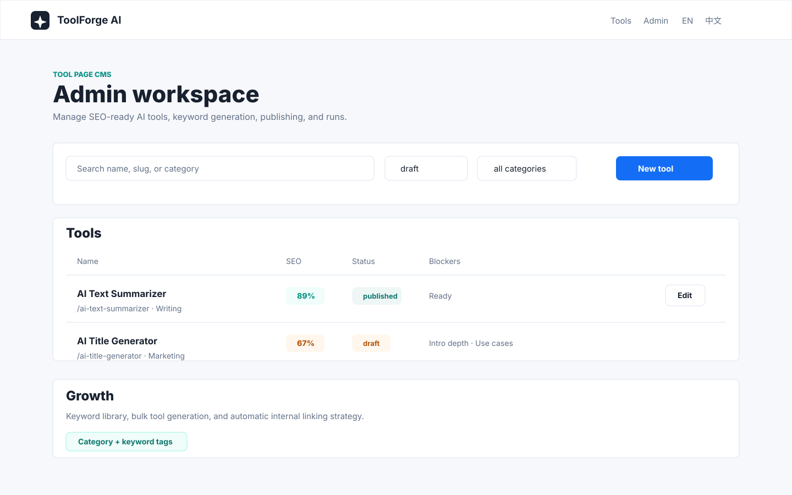

# ToolForge AI

ToolForge AI is an SEO-first AI tool page CMS. It lets you configure form-based AI tools, generate draft pages from keywords, manage publishing readiness, and ship indexable pages with sitemap, FAQ schema, and multilingual routes.



## Features

- Configurable AI tool pages: fields, prompts, result format, and SEO blocks
- Admin workspace with tool table, search, filters, SEO readiness, and bulk publish actions
- Keyword library for bulk draft tool generation
- Automatic internal linking based on category and keyword tags
- Runs log for generated outputs
- Draft preview support
- Sitemap and robots.txt
- Multilingual public routes for English and Chinese:
  - `/en`, `/en/tools`, `/en/[slug]`
  - `/zh`, `/zh/tools`, `/zh/[slug]`
- Prisma persistence with local SQLite and a clear PostgreSQL upgrade path
- Optional OpenAI execution when `OPENAI_API_KEY` is set; mock provider otherwise

## Tech Stack

- Next.js App Router
- React
- Prisma
- SQLite for local development
- Optional PostgreSQL for production

## Getting Started

```bash
npm install
cp .env.example .env
cp .env.example .env.local
npm run db:push
npm run db:seed
npm run dev
```

Open:

```text
http://localhost:3000
http://localhost:3000/admin
```

## Environment Variables

```bash
DATABASE_URL="file:./dev.db"
ADMIN_PASSWORD=change-this-password
ADMIN_SESSION_SECRET=replace-with-a-long-random-secret
OPENAI_API_KEY=
NEXT_PUBLIC_SITE_URL=http://localhost:3000
```

If `ADMIN_PASSWORD` is not set, the admin workspace is open for local development.

## Database

Local development uses SQLite:

```bash
npm run db:push
npm run db:seed
```

For PostgreSQL, update the Prisma datasource provider and set `DATABASE_URL` to your production connection string. See [docs/database.md](docs/database.md).

## License

This project is open source under the [MIT License](LICENSE).
